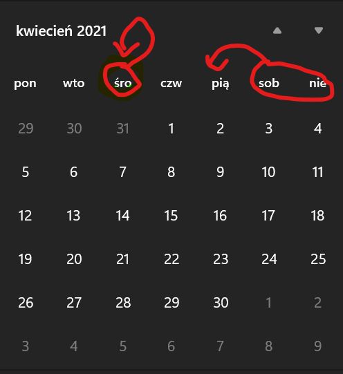

# Waluter

## Zasada działania i geneza
<h2>Waluter</h2> jest przede wszystkim jednemu konkretnemu przepisowi w polskim prawie - jeśli dokona się transakcji i kupujący zapłaci w walucie nie polskiej to sprzedający na fakturze musi wpisać kwote w złotych po oficjalnym kursie NBP tej waluty z ostatniego dnia roboczego.
<p align = center>

</p>
<p align = center>

</p>
Przykład tego jak działa Waluter - pobiera z <a href="http://api.nbp.pl">NBP API</a> cenę ostatniego dnia roboczego.

Projekt zrealizowany przy użyciu frameworka PyQt5.

## Główna funkcja programu
```py
 def currency(self):
        def datesInteraction(date1):
            date1 = date1.toPyDate()
            date1 -= timedelta(days=15)
            year = str(date1.year)
            month = str(date1.month)
            day = str(date1.day)
            if int(month) < 10:
                month = '0' + month
            if int(day) < 10:
                day = '0' + day

            return year + '-' + month + '-' + day

        code = self.slider.currentText()
        table = 'A'
        try:
            callendarDate = self.callendar.selectedDate()
            year = callendarDate.year()
            month = callendarDate.month()
            day = callendarDate.day()
            moneyPremade = self.money.text()
            if float(moneyPremade.replace(',','.')) >= 0:
                money = float(moneyPremade.replace(',','.'))
            else:
                self.answer.setText('popraw wpisywaną kwotę')
                return -1
        except ValueError:
            self.answer.setText('0,0')
            return -1
        
        if day < 10:
            day = '0' + str(day)
        if month < 10:
            month = '0' + str(month)

        date = str(year) + '-' + str(month) + '-' + str(day)
        dateBeforeUltimate = datesInteraction(callendarDate)

        try:
            r = get('http://api.nbp.pl/api/exchangerates/rates/' + table + '/' + code + '/' + dateBeforeUltimate + '/' + date + '/?format=json')
            response = r.json()
            if response['rates'][-1]['effectiveDate'] != str(callendarDate.toPyDate()):
                course = response['rates'][-1]['mid']
                text = str(round(money*course, 2))
                text = text.replace('.', ',')
                self.answer.setText(text)
            else:
                course = response['rates'][-2]['mid']
                text = str(round(money*course, 2))
                text = text.replace('.', ',')
                self.answer.setText(text)
        except exceptions.ConnectionError:
            self.answer.setText('brak połączenia z internetem')

```

```py
def datesInteraction(date1)
```
Funkcja odpowiadająca za konwersje daty na format akceptowany przez API.

```py
self.callendar
self.slider
self.money
```
Pola w których użytkownik wprowadza odpowiednio Datę zakupu/transakcji, wybiera walutę i wpisuje kwotę transakcji.
```py
self.answer
```
Pole, w którym użytkownik otrzymuje przeliczoną podaną kwotę z podanej waluty na złote, z podanej daty transakcji.
